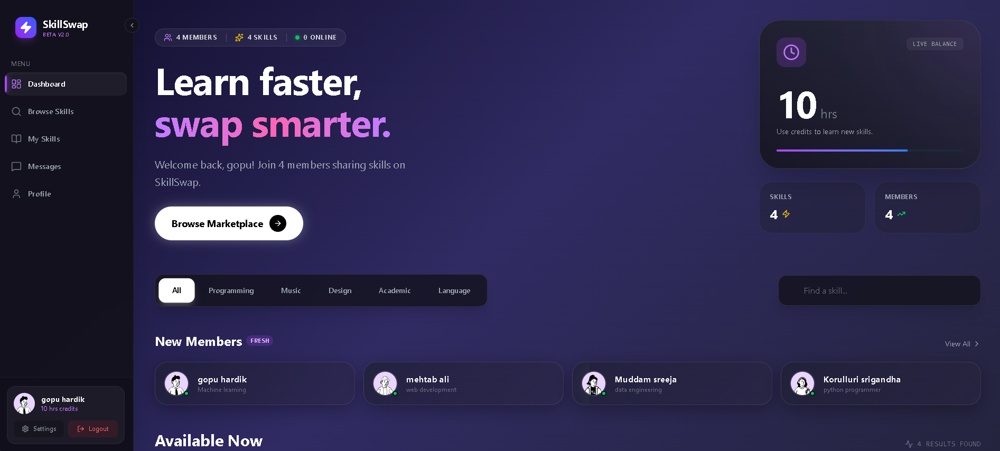
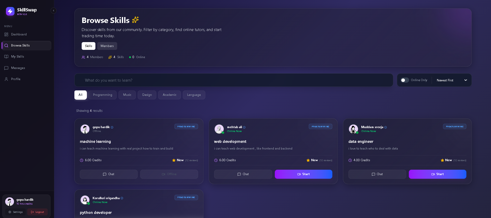
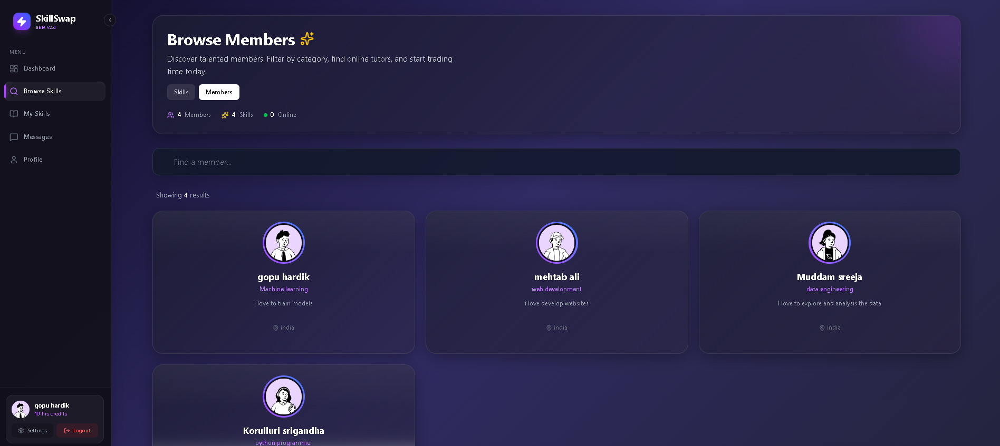
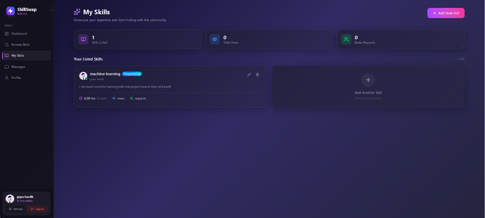
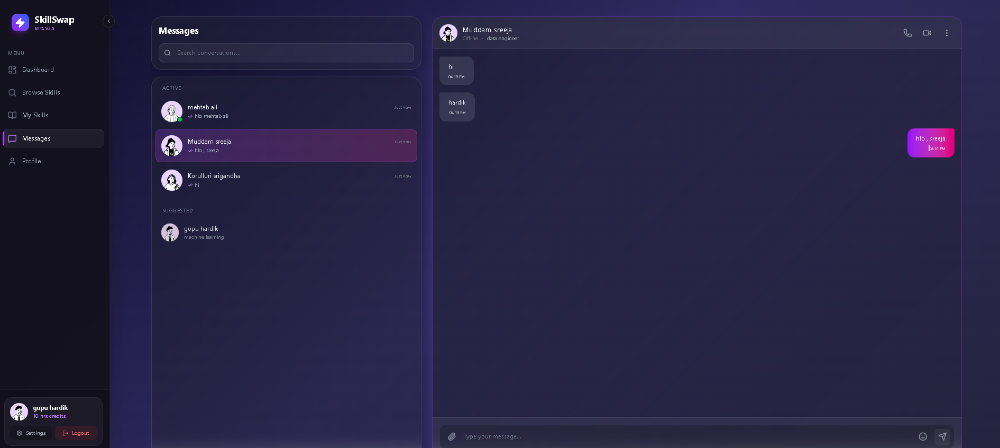
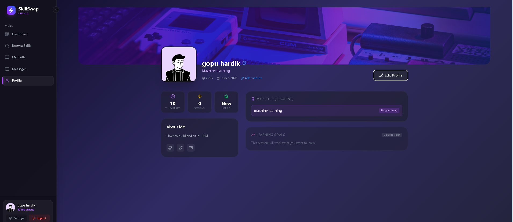
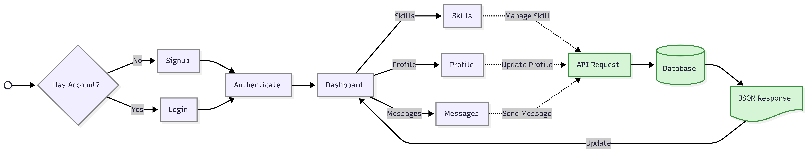
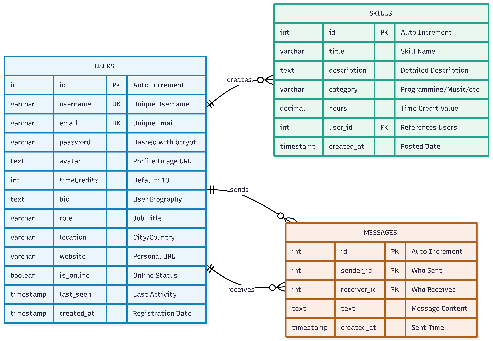
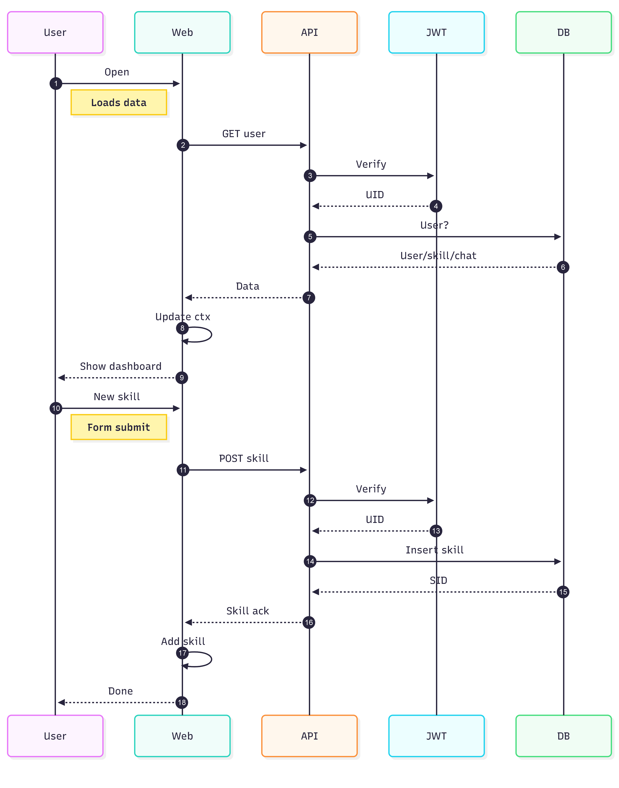

<p align="center">
  
  
  
  
  
  
</p>

<h1 align="center">🔄 SkillSwap — Trade Skills, Not Money</h1>

<p align="center">
  <strong>A full-stack time-banking platform enabling students to exchange skills using time credits instead of money.</strong>
  <br />
  <em>Learn Guitar for React lessons. Trade hours, grow together.</em>
</p>

<p align="center">
  <a href="#-features">Features</a> •
  <a href="#-screenshots">Screenshots</a> •
  <a href="#-system-architecture">Architecture</a> •
  <a href="#-database-design">Database</a> •
  <a href="#-tech-stack">Tech Stack</a> •
  <a href="#-getting-started">Setup</a> •
  <a href="#-api-reference">API</a> •
  <a href="#-project-structure">Structure</a>
</p>

---

## 📌 Problem Statement

Students often possess diverse skills but lack the financial means to access paid learning. Traditional tutoring platforms rely on monetary transactions, creating barriers for many learners. **SkillSwap** eliminates this barrier by introducing a **time-credit economy** — every hour you teach earns you an hour of learning.

## ✨ Features

| Feature | Description |
|---------|-------------|
| 🔐 **Secure Authentication** | JWT-based login/signup with bcrypt password hashing |
| 📊 **Interactive Dashboard** | Real-time community stats, trending skills, and active members |
| 🔍 **Skill Marketplace** | Browse, search, and filter skills by category |
| ⏱️ **Time-Credit System** | Earn credits by teaching, spend them to learn — no money involved |
| 💬 **Real-Time Messaging** | In-app chat with optimistic UI updates for instant feedback |
| 📹 **Video Call Integration** | Connect face-to-face for skill exchange sessions |
| 👤 **Profile Management** | Customizable profiles with avatar, bio, role, and location |
| 🎯 **Onboarding Flow** | Guided onboarding modal for new users |
| 🟢 **Online Status Tracking** | See who's currently available for skill exchange |
| 📱 **Responsive Design** | Fully responsive UI with collapsible sidebar navigation |

---

## 📸 Screenshots

### Dashboard
<p align="center">
  
</p>

### Browse Skills
<p align="center">
  
</p>

### Browse Members
<p align="center">
  
</p>

### My Skills
<p align="center">
  
</p>

### Messages
<p align="center">
  
</p>

### Profile
<p align="center">
  
</p>

---

## 🏗️ System Architecture

<p align="center">
  
</p>

---

## 🗃️ Database Design

### Entity-Relationship Diagram

<p align="center">
  
</p>

### Database Schema

<p align="center">
  
</p>

### Database Relationships

| Relationship | Type | Description |
|---|---|---|
| `users` → `skills` | One-to-Many | A user can offer multiple skills |
| `users` → `messages` (sender) | One-to-Many | A user can send many messages |
| `users` → `messages` (receiver) | One-to-Many | A user can receive many messages |

> **Cascade Delete**: Deleting a user automatically removes all their skills and messages.

---

## 🔄 Application Flow

<p align="center">
  
</p>

---

## 🛠️ Tech Stack

### Frontend
| Technology | Version | Purpose |
|---|---|---|
| **React** | 19.2 | UI Library with Hooks & Context API |
| **Vite** | 7.2 | Next-gen build tool & dev server |
| **TailwindCSS** | 4.1 | Utility-first CSS framework |
| **React Router DOM** | 7.12 | Client-side routing & navigation |
| **Lucide React** | 0.562 | Modern icon library |

### Backend
| Technology | Version | Purpose |
|---|---|---|
| **Node.js** | LTS | Server-side JavaScript runtime |
| **Express** | 5.2 | Minimal web framework for REST APIs |
| **MySQL2** | 3.16 | MySQL client with connection pooling |
| **jsonwebtoken** | 9.0 | JWT-based authentication |
| **bcryptjs** | 3.0 | Secure password hashing (salt rounds: 10) |
| **dotenv** | 17.2 | Environment variable management |
| **CORS** | 2.8 | Cross-Origin Resource Sharing |

---

## 🚀 Getting Started

### Prerequisites

- **Node.js** (v18+) — [Download](https://nodejs.org/)
- **MySQL** (v8.0+) — [Download](https://dev.mysql.com/downloads/)
- **Git** — [Download](https://git-scm.com/)

### 1. Clone the Repository

```bash
git clone https://github.com/Gopulucky/RTRP.git
cd RTRP
```

### 2. Set Up the Database

```sql
-- Open MySQL Workbench or CLI and run:
SOURCE RTRP -B/db/mysql_init.sql;
```

Or manually create the database:
```sql
CREATE DATABASE IF NOT EXISTS rtrp_db;
```

### 3. Configure Environment Variables

Create a `.env` file inside `RTRP -B/`:

```env
PORT=5000
DB_HOST=localhost
DB_USER=root
DB_PASSWORD=your_mysql_password
DB_NAME=rtrp_db
JWT_SECRET=your_super_secret_key
```

### 4. Install & Run the Backend

```bash
cd "RTRP -B"
npm install
npm run dev        # Starts with nodemon for hot-reload
```

> Backend runs at `http://localhost:5000`

### 5. Install & Run the Frontend

```bash
cd "RTRP -F"
npm install
npm run dev        # Starts Vite dev server
```

> Frontend runs at `http://localhost:5173`

---

## 📡 API Reference

### Authentication

| Method | Endpoint | Description | Auth |
|---|---|---|---|
| `POST` | `/api/auth/signup` | Register a new user | ❌ |
| `POST` | `/api/auth/login` | Login & get JWT token | ❌ |

### Skills

| Method | Endpoint | Description | Auth |
|---|---|---|---|
| `GET` | `/api/skills` | Fetch all available skills | ❌ |
| `POST` | `/api/skills` | Create a new skill listing | ✅ |
| `PUT` | `/api/skills/:id` | Update a skill | ✅ |
| `DELETE` | `/api/skills/:id` | Delete a skill | ✅ |

### User

| Method | Endpoint | Description | Auth |
|---|---|---|---|
| `GET` | `/api/user` | Get current user profile | ✅ |
| `PUT` | `/api/user` | Update profile details | ✅ |
| `POST` | `/api/user/credits/add` | Add time credits | ✅ |
| `POST` | `/api/user/credits/spend` | Spend time credits | ✅ |

### Chat

| Method | Endpoint | Description | Auth |
|---|---|---|---|
| `GET` | `/api/chats` | Get all conversations | ✅ |
| `GET` | `/api/chats/:userId` | Get chat with a specific user | ✅ |
| `POST` | `/api/chats/:userId` | Send a message to a user | ✅ |

### Utility

| Method | Endpoint | Description | Auth |
|---|---|---|---|
| `GET` | `/api/stats` | Community statistics | ❌ |
| `GET` | `/api/health` | Server health check | ❌ |

> **Auth**: ✅ = Requires `Authorization: Bearer <token>` header

---

## 📁 Project Structure

```
RTRP/
├── 📂 RTRP -F/                    # Frontend (React + Vite)
│   ├── index.html                  # Entry HTML
│   ├── vite.config.js              # Vite configuration
│   ├── package.json                # Frontend dependencies
│   └── 📂 src/
│       ├── App.jsx                 # Root component with routing
│       ├── main.jsx                # React entry point
│       ├── index.css               # Global styles
│       ├── 📂 context/
│       │   └── AppContext.jsx      # Global state management
│       ├── 📂 pages/
│       │   ├── Dashboard.jsx       # Home dashboard with stats
│       │   ├── BrowseSkills.jsx    # Skill marketplace
│       │   ├── MySkills.jsx        # Manage personal skills
│       │   ├── Messages.jsx        # Chat interface
│       │   ├── Profile.jsx         # User profile management
│       │   ├── Login.jsx           # Login page
│       │   └── Signup.jsx          # Registration page
│       └── 📂 components/
│           ├── Sidebar.jsx         # Collapsible navigation
│           ├── SkillCard.jsx       # Skill display card
│           ├── ChatPanel.jsx       # Chat messaging panel
│           ├── VideoCall.jsx       # Video call interface
│           ├── OnboardingModal.jsx # New user onboarding
│           ├── Toast.jsx           # Notification toasts
│           └── LoadingScreen.jsx   # Loading animation
│
├── 📂 RTRP -B/                    # Backend (Node.js + Express)
│   ├── server.js                   # Express server entry point
│   ├── package.json                # Backend dependencies
│   ├── .env                        # Environment variables
│   ├── 📂 db/
│   │   ├── database.js             # MySQL connection pool & ORM
│   │   └── mysql_init.sql          # Database initialization script
│   ├── 📂 middleware/
│   │   └── auth.js                 # JWT authentication middleware
│   └── 📂 routes/
│       ├── authRoutes.js           # Signup & Login endpoints
│       ├── skillsRoutes.js         # Skills CRUD operations
│       ├── userRoutes.js           # Profile & credits management
│       └── chatRoutes.js           # Messaging endpoints
│
└── 📂 diagram/                     # Architecture & design diagrams
```

---

## 🔒 Security Implementation

| Layer | Implementation |
|---|---|
| **Password Storage** | bcrypt.js with 10 salt rounds — passwords are never stored in plaintext |
| **Authentication** | JWT tokens with 1-hour expiry for session management |
| **Route Protection** | Custom middleware validates JWT on every protected endpoint |
| **Input Validation** | Server-side validation on all user inputs |
| **CORS** | Configured to allow cross-origin requests from the frontend |
| **Error Handling** | Global error handler prevents stack trace leaks in production |

---

## 💡 Key Design Decisions

### Time-Credit Economy
Instead of monetary transactions, SkillSwap uses a **time-based credit system**:
- New users start with **10 credits**
- Teaching a skill **earns** credits equal to session hours
- Learning a skill **costs** credits equal to session hours
- This creates a **self-sustaining ecosystem** where knowledge is the currency

### Optimistic UI Updates
Messages are displayed immediately in the UI before the API confirms delivery, providing an **instant and responsive** user experience. Failed messages are rolled back gracefully.

### Connection Pooling
The MySQL connection uses a **pool of 10 connections** with queue management, ensuring high performance under concurrent load without connection exhaustion.

---

## 🗺️ Roadmap

- [ ] 🔔 Real-time notifications with WebSocket
- [ ] ⭐ Skill ratings & review system
- [ ] 🗓️ Session scheduling calendar
- [ ] 📊 Analytics dashboard for skill trends
- [ ] 🌐 Deploy to production (Vercel + Railway)
- [ ] 📱 Progressive Web App (PWA) support

---

## 🤝 Contributing

1. Fork the repository
2. Create a feature branch (`git checkout -b feature/amazing-feature`)
3. Commit your changes (`git commit -m 'Add amazing feature'`)
4. Push to the branch (`git push origin feature/amazing-feature`)
5. Open a Pull Request

---

## 📄 License

This project is licensed under the **ISC License**.

---

<p align="center">
  <strong>Built with ❤️ as part of the RTRP Internship Program</strong>
  <br />
  <em>SkillSwap — Where every hour of teaching becomes an hour of learning.</em>
</p>
