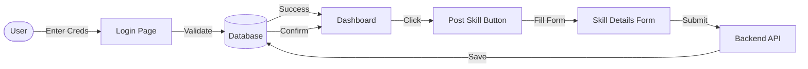

# Project Presentation Script: SkillSwap (RTRP)

**Project Title:** SkillSwap (Real-Time Resource Pool)
**Course:** [Insert Course Name]
**Team Members & Roles:**
- **[Member 1 Name]:** Frontend Development (React UI)
- **[Member 2 Name]:** Backend API (Node/Express)
- **[Member 3 Name]:** Database Design & Integration
**Guide/Mentor:** [Insert Mentor Name]

---

## 1. Introduction
**Slide Title:** Introduction to SkillSwap

**Speaker Notes:**
Good morning/afternoon everyone. Today, we are presenting our project, **SkillSwap**, which is a Real-Time Resource Pool (RTRP).
SkillSwap is a web-based platform designed to facilitate peer-to-peer skill exchange without the need for money. It operates on a "Time Banking" concept where time is the currency.
In a world where specialized education is often expensive, SkillSwap aims to democratize learning by allowing anyone to teach what they know and learn what they don't, simply by trading their time.

---

## 2. Problem Statement
**Slide Title:** Problem Statement & Motivation

**Key Points:**
- **High Cost of Education:** Professional tutoring and courses are often expensive.
- **One-Way Learning:** Traditional platforms are often just consumption-based (videos), lacking interactive feedback.
- **Undervalued Skills:** Many people have valuable skills (cooking, coding, music) but no easy platform to share them for return value.
- **Lack of Community:** It's hard to find a local or dedicated learning partner for mutual growth.

**Impact:** This affects students, hobbyists, and professionals who want to upskill but are limited by budget or lack of connections.

---

## 3. Objectives & Goals
**Slide Title:** Project Objectives

**Key Points:**
1.  **Create a Time-Based Economy:** Develop a system where 1 hour of teaching = 1 hour of learning credit.
2.  **Facilitate Peer-to-Peer Connection:** Enable users to find others based on specific skills.
3.  **Ensure Real-Time Interaction:** Provide chat and video capabilities for seamless communication.
4.  **User-Friendly Interface:** Build a responsive, modern web application for easy navigation.

---

## 4. Literature Review / Background
**Slide Title:** Existing Solutions & Gaps

**Comparison:**
- **Coursera/Udemy:** Great content, but one-way and expensive. No peer interaction.
- **Freelance Sites (Upwork/Fiverr):** Transactional and money-focused. Not suitable for casual learning trades.
- **Traditional Time Banks:** Often offline or localized, lacking modern digital tools.

**Our Gap Analysis:**
Existing solutions either cost money or lack the structured "skill-for-skill" direct exchange mechanism. SkillSwap bridges this by modernizing the time-bank concept with a dedicated web app.

---

## 5. Methodology
**Slide Title:** Development Methodology

**Approach:**
- **Agile Development:** We developed the project in sprints—first building the backend, then the frontend UI, and finally integrating them.
- **Iterative Testing:** Each feature (Auth, Chat) was tested individually before integration.

**Tools & Technologies:**
- **Frontend:** React + Vite + Tailwind CSS
- **Backend:** Node.js + Express.js
- **Database:** MySQL
- **Authentication:** JWT (JSON Web Tokens)

---

## 6. System Design
**Slide Title:** System Architecture

**Explanation:**
- **Client-Server Model:** The browser (Client) sends HTTP requests to our Node.js Server.
- **API Layer:** Express.js handles these requests (GET skills, POST login, etc.).
- **Data Layer:** The server queries the MySQL database to fetch user profiles and skill data.
- **Security:** Passwords are hashed using `bcrypt` before storage.

**Slide Title:** Database Design (ER Diagram)

**Key Entities:**
- **Users:** Stores ID, Name, Email, Password, Bio, TimeBalance.
- **Skills:** Stores Title, Description, Category, OwnerID.
- **Relationship:** A "One-to-Many" relationship exists between Users and Skills (One user can offer multiple skills).

**Process Flow: Login & Post Skill**

**Skill Exchange Sequence:**

---

## 7. Implementation Details
**Slide Title:** Key Features & Implementation

**1. Authentication System:**
- Users sign up/login.
- Secure JWT implementation.
- Passwords hashing with bcrypt.

**2. Skill Marketplace:**
- Post skills with Title, Description, Category.
- Filter skills by category.

**3. Dashboard:**
- View Credits Earned.
- Manage listed skills.

**4. Project Demonstration (Screenshots):**
*(Insert 4-5 key screenshots here)*
- **Login/Signup Page:** Shows secure access.
- **Dashboard:** Shows time credit balance and stats.
- **Browse Skills:** Shows grid of available skills.
- **Profile Page:** Shows user details and bio.
- **Chat Interface:** Shows message history.

---

## 8. Testing & Results
**Slide Title:** Testing Strategy

**Methods Used:**
- **Unit Testing:** Manually tested individual API endpoints using Postman (e.g., ensuring Login returns a token).
- **Integration Testing:** Verified that the Frontend correctly displays data fetched from the Backend.
- **Cross-Browser Testing:** Checked UI consistency on Chrome and Edge.

**Results:**
- "Successfully created X users"
- "Posted Y skills in the system"
- "Authentication working properly"
- "Database storing data correctly"

**Implementation Status (Honesty Check):**
- **Working:** Login, Signup, Skill Posting, Browse Skills, Dashboard.
- **Partially Working:** Chat system (UI ready, realtime connecting).
- **Not Implemented:** Video calls, Rating system.

---

## 9. Challenges & Solutions
**Slide Title:** Key Learnings & Challenges

**Personal Learnings:**
- "Learned how to connect React with Node.js backend."
- "Understood JWT authentication implementation flow."
- "Learned database design and defining relationships."

**Technical Challenges:**
- **State Management:** Keeping user data synced. *Solved with React Context.*
- **Database Connection:** Switching to MySQL. *Solved with mysql2 driver.*
- **Responsive Design:** Mobile-friendly layout. *Solved with Tailwind Grid.*

---

## 10. Future Scope
**Slide Title:** Future Enhancements

- **Video Call Integration:** Direct in-app video conferencing (WebRTC).
- **Rating System:** Allow learners to rate teachers to ensure quality.
- **Mobile App:** Develop a React Native version for iOS/Android.
- **AI Recommendations:** Suggest skills based on user interests.

---

## 11. Conclusion
**Slide Title:** Conclusion

SkillSwap serves as a functional proof-of-concept for a demonetized, community-driven education platform. It successfully implements full-stack web technologies to solve the problem of accessible peer-to-peer learning.

**References:**
- React Documentation (react.dev)
- Node.js & Express Guides
- "Time Banking" concepts (Wikipedia/Research papers)

---
**Thank You!**
*Questions?*
