# Project Presentation Script: SkillSwap (RTRP)

**Project Title:** SkillSwap (Real-Time Resource Pool)
**Course:** [Insert Course Name]
**Team Members & Roles:**
- **[Member 1 Name]:** Frontend Development (React UI)
- **[Member 2 Name]:** Backend API (Node/Express)
- **[Member 3 Name]:** Database Design & Integration
**Guide/Mentor:** [Insert Mentor Name]

---

## 1. Introduction
**Slide Title:** Introduction to SkillSwap

**Speaker Notes:**
Good morning/afternoon everyone. Today, we are presenting our project, **SkillSwap**, which is a Real-Time Resource Pool (RTRP).
SkillSwap is a web-based platform designed to facilitate peer-to-peer skill exchange without the need for money. It operates on a "Time Banking" concept where time is the currency.
In a world where specialized education is often expensive, SkillSwap aims to democratize learning by allowing anyone to teach what they know and learn what they don't, simply by trading their time.

---

## 2. Problem Statement
**Slide Title:** Problem Statement & Motivation

**Key Points:**
- **High Cost of Education:** Professional tutoring and courses are often expensive.
- **One-Way Learning:** Traditional platforms are often just consumption-based (videos), lacking interactive feedback.
- **Undervalued Skills:** Many people have valuable skills (cooking, coding, music) but no easy platform to share them for return value.
- **Lack of Community:** It's hard to find a local or dedicated learning partner for mutual growth.

**Impact:** This affects students, hobbyists, and professionals who want to upskill but are limited by budget or lack of connections.

---

## 3. Objectives & Goals
**Slide Title:** Project Objectives

**Key Points:**
1.  **Create a Time-Based Economy:** Develop a system where 1 hour of teaching = 1 hour of learning credit.
2.  **Facilitate Peer-to-Peer Connection:** Enable users to find others based on specific skills.
3.  **Ensure Real-Time Interaction:** Provide chat and video capabilities for seamless communication.
4.  **User-Friendly Interface:** Build a responsive, modern web application for easy navigation.

---

## 4. Literature Review / Background
**Slide Title:** Existing Solutions & Gaps

**Comparison:**
- **Coursera/Udemy:** Great content, but one-way and expensive. No peer interaction.
- **Freelance Sites (Upwork/Fiverr):** Transactional and money-focused. Not suitable for casual learning trades.
- **Traditional Time Banks:** Often offline or localized, lacking modern digital tools.

**Our Gap Analysis:**
Existing solutions either cost money or lack the structured "skill-for-skill" direct exchange mechanism. SkillSwap bridges this by modernizing the time-bank concept with a dedicated web app.

---

## 5. Methodology
**Slide Title:** Development Methodology

**Approach:**
- **Agile Development:** We developed the project in sprints—first building the backend, then the frontend UI, and finally integrating them.
- **Iterative Testing:** Each feature (Auth, Chat) was tested individually before integration.

**Tools & Technologies:**
| Layer | Technology |
|-------|------------|
| Frontend | React 19 + Vite + Tailwind CSS |
| Backend | Node.js + Express.js |
| Database | MySQL (with mysql2 driver) |
| Authentication | JWT (JSON Web Tokens) + bcrypt |
| State Management | React Context API |

---

## 6. System Design & Architecture

### 6.1 Frontend Architecture
**Slide Title:** Frontend Architecture

```mermaid
graph TB
    subgraph Browser["🌐 Browser"]
        subgraph ReactApp["React 19 Application"]
            Router[React Router DOM]
            Context[AppContext Provider]
            
            subgraph Pages["📄 Pages"]
                Login[Login.jsx]
                Signup[Signup.jsx]
                Dashboard[Dashboard.jsx]
                Browse[BrowseSkills.jsx]
                MySkills[MySkills.jsx]
                Profile[Profile.jsx]
                Messages[Messages.jsx]
            end
            
            subgraph Components["🧩 Components"]
                Sidebar[Sidebar]
                SkillCard[SkillCard]
                ChatPanel[ChatPanel]
                VideoCall[VideoCall]
                Toast[Toast]
            end
        end
    end
    
    Router --> Pages
    Context --> Pages
    Pages --> Components
    
    subgraph Styling["🎨 Styling"]
        Tailwind[Tailwind CSS]
        Custom[Custom CSS]
    end
    
    subgraph Build["⚡ Build Tool"]
        Vite[Vite Dev Server]
    end
    
    ReactApp --> Styling
    Vite --> ReactApp
```

**Key Points:**
- **Single Page Application (SPA):** React Router handles client-side navigation
- **Global State:** AppContext manages user data, skills, and chat state
- **Component-Based:** Reusable components like SkillCard and ChatPanel
- **Modern Styling:** Tailwind CSS for responsive, utility-first design

---

### 6.2 Backend Architecture
**Slide Title:** Backend Architecture

```mermaid
graph TB
    subgraph Server["🖥️ Node.js Server"]
        Express[Express.js App]
        
        subgraph Middleware["🔐 Middleware"]
            CORS[CORS]
            JSON[JSON Parser]
            Auth[JWT Auth]
        end
        
        subgraph Routes["📡 API Routes"]
            AuthRoutes["/api/auth"]
            UserRoutes["/api/user"]
            SkillRoutes["/api/skills"]
            ChatRoutes["/api/chats"]
        end
        
        subgraph Database["💾 Database Layer"]
            DBModule[database.js]
            Pool[MySQL Pool]
        end
    end
    
    Express --> Middleware
    Middleware --> Routes
    Routes --> DBModule
    DBModule --> Pool
    
    subgraph External["🌍 External"]
        Client[Frontend Client]
        MySQL[(MySQL Server)]
    end
    
    Client -->|HTTP Requests| Express
    Pool -->|Queries| MySQL
```

**API Endpoints:**
| Route | Method | Description |
|-------|--------|-------------|
| `/api/auth/signup` | POST | Register new user |
| `/api/auth/login` | POST | Login & get JWT token |
| `/api/user` | GET | Get current user profile |
| `/api/user/all` | GET | Get all users (public) |
| `/api/user/logout` | POST | Set user offline |
| `/api/skills` | GET/POST | Get all skills / Create skill |
| `/api/skills/:id` | GET/DELETE | Get/Delete specific skill |
| `/api/chats` | GET | Get all user conversations |
| `/api/chats/:userId` | GET/POST | Get/Send messages |

---

### 6.3 Signup/Login Flow
**Slide Title:** Authentication Flow (Signup & Login)

**Security Features:**
- ✅ Password hashing with bcrypt (10 salt rounds)
- ✅ JWT tokens with 1-hour expiration
- ✅ Protected routes with auth middleware
- ✅ Real-time online status tracking

---

### 6.4 Database Schema
**Slide Title:** Database Architecture (MySQL)

**Database Relationships:**
| Relationship | Type | Description |
|--------------|------|-------------|
| Users → Skills | One-to-Many | One user can create many skills |
| Users → Messages (sender) | One-to-Many | One user can send many messages |
| Users → Messages (receiver) | One-to-Many | One user can receive many messages |

**Constraints:**
- `ON DELETE CASCADE` for skills (delete user = delete their skills)
- `ON DELETE CASCADE` for messages (delete user = delete their messages)
- `UNIQUE` constraints on username and email

---

### 6.5 Full System Flow
**Slide Title:** Complete System Flow

**Complete Data Flow:**

```mermaid
sequenceDiagram
    participant User as 👤 User
    participant Browser as 🌐 React App
    participant API as 🖥️ Express API
    participant Auth as 🔐 JWT Middleware
    participant DB as 💾 MySQL

    User->>Browser: Opens App
    Browser->>API: GET /api/user (with JWT)
    API->>Auth: Verify Token
    Auth-->>API: User ID
    API->>DB: SELECT user WHERE id = ?
    DB-->>API: User Data
    API-->>Browser: { user, skills, chats }
    Browser->>Browser: Update Context State
    Browser-->>User: Render Dashboard

    User->>Browser: Creates New Skill
    Browser->>API: POST /api/skills (with JWT)
    API->>Auth: Verify Token
    Auth-->>API: User ID
    API->>DB: INSERT INTO skills
    DB-->>API: New Skill ID
    API-->>Browser: { skill }
    Browser->>Browser: Update Skills State
    Browser-->>User: Show Success Toast
```

---

## 7. Implementation Details
**Slide Title:** Key Features & Implementation

**1. Authentication System:**
- Secure user registration and login
- JWT token-based authentication
- Password hashing with bcrypt
- Session persistence with localStorage

**2. Skill Marketplace:**
- Create skills with Title, Description, Category, Hours
- Browse all available skills from community
- Filter skills by category (Programming, Music, Design, etc.)
- Real-time online status indicator for skill owners

**3. Real-Time Chat System:**
- Persistent chat messages stored in MySQL
- Message history per conversation
- Real-time message sending and receiving

**4. User Profiles:**
- Customizable avatars (DiceBear integration)
- Bio, role, location, and website fields
- View your own skills on profile page
- Time credits balance display

**5. Dashboard:**
- View community statistics (members, skills, online)
- Quick access to browse marketplace
- Featured skills grid
- Member discovery section

---

## 8. Testing & Results
**Slide Title:** Testing Strategy

**Methods Used:**
- **API Testing:** Tested individual endpoints using browser dev tools and Postman
- **Integration Testing:** Verified Frontend correctly displays data from Backend API
- **Cross-Browser Testing:** Checked UI consistency on Chrome, Edge, and Firefox
- **Database Testing:** Verified data persistence in MySQL Workbench

**Results:**
- ✅ Successfully implemented user authentication
- ✅ Skills stored and retrieved from MySQL database
- ✅ Chat messages persisted across sessions
- ✅ Real-time online/offline status tracking
- ✅ Responsive design on all screen sizes

**Implementation Status:**
| Feature | Status |
|---------|--------|
| User Authentication | ✅ Complete |
| Skill CRUD Operations | ✅ Complete |
| Browse & Filter Skills | ✅ Complete |
| Chat Messaging | ✅ Complete |
| User Profiles | ✅ Complete |
| Online Status Tracking | ✅ Complete |
| Video Calls | ⚠️ UI Ready (WebRTC pending) |
| Rating System | 📋 Planned |

---

## 9. Challenges & Solutions
**Slide Title:** Key Learnings & Challenges

**Personal Learnings:**
- "Learned how to build a full-stack application with React and Node.js"
- "Understood JWT authentication flow and secure password handling"
- "Learned MySQL database design with foreign key relationships"
- "Implemented real-time features like online status tracking"

**Technical Challenges:**

| Challenge | Solution |
|-----------|----------|
| Database Migration | Migrated from SQLite to MySQL using mysql2 driver |
| State Management | Used React Context API for global state |
| API Authentication | Implemented JWT middleware for protected routes |
| Real-time Status | Added is_online column with login/logout tracking |
| Responsive Design | Used Tailwind CSS Grid and Flexbox |

---

## 10. Future Scope
**Slide Title:** Future Enhancements

- **Video Call Integration:** WebRTC-based in-app video conferencing
- **Rating & Review System:** Allow learners to rate teachers
- **Skill Matching Algorithm:** AI-powered skill recommendations
- **Notification System:** Push notifications for messages and requests
- **Mobile App:** React Native version for iOS/Android
- **Payment Integration:** Optional paid premium skills

---

## 11. Conclusion
**Slide Title:** Conclusion

SkillSwap serves as a fully functional proof-of-concept for a demonetized, community-driven education platform. It successfully implements:

- ✅ Full-stack web development (React + Node.js + MySQL)
- ✅ Secure authentication with JWT
- ✅ Real-time features (chat, online status)
- ✅ Modern, responsive UI design
- ✅ Persistent data storage

The platform demonstrates the viability of peer-to-peer learning through time banking.

**References:**
- React Documentation (react.dev)
- Node.js & Express.js Guides (nodejs.org, expressjs.com)
- MySQL Documentation (dev.mysql.com)
- JWT.io (jwt.io)
- "Time Banking" concepts (Wikipedia/Research papers)

---
**Thank You!**
